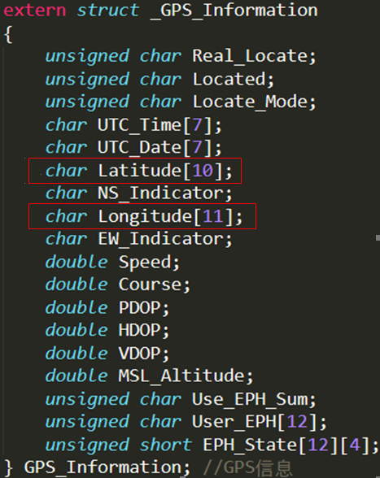

GPS模块只要接上电就会不断地发定位信息到串口上，我们准备用的是VK1613 GPS模块，比较小巧，价钱合理。

因为我们把试验箱当作密码锁，即门的一部分，所以我们要把GPS模块也连接在上面作定位。引脚如下：

- VPP – 3.3V (VCC)
- GND – GND
- RX – TX
- TX – RX

我们要定位的门是不会移动的物件，所以对GPS模块的性能并没有什么要求。接口是全速ttl接口，协议是NMEA0183。

我们要处理的主要语句是推荐定位信息，例子如下：

$GPRMC, 191934.767, A, 4738.0173, N, 12211.1874, W, 0.109623, 12.14, 291004, , *21

解析出来的信息如下：

- 时间：19点19分34.767秒
- 定位状态：有效
- 纬度：北纬47度38.0173分
- 经度：西经122度11.1874分
- 速度：0.109624节
- 航向：北方12.14度
- 日期：04年10月29日

我们主要要获取的信息只有经纬度，因为用的是百度地图API，因为有城市定位，所以不需要东西经南北纬这种方向定位。因为没有实物来做实验，所以也无法做测试偏移，所以我们就当作没有偏移处理了。

数据结构如下，之后会用到的只有经度和纬度，但是这个代码把所有会收到的数据信息都有保存下来，以备不时之需。

 
获取的经纬度信息，本来应该通过wifi模块传到电脑上的，但是没有esp8266的websocket的开发环境，暂时无法让它支持websocket，但是实现了的话，可以在电脑端用websocket接收经纬度的数据信息。代码如下：
 
最后的效果图如下：
